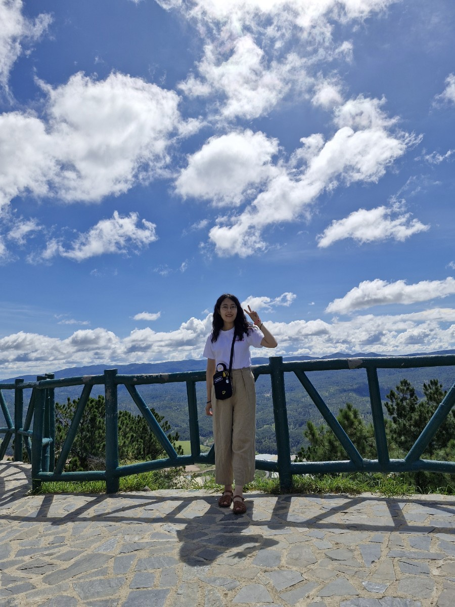

# 이효준의 자기소개

</img>

<!--  -->

---

## 자기소개

- :purple_heart:이름 : 이효준
- :heart:사는 곳 : 서울시 강동구 암사동
- :blue_heart:MBTI : INFP
- :green_heart:취미 : 독서, 운동, SNS로 웃긴거 보기

---

## Study

---

## Profile Stats

> 안녕하세요
